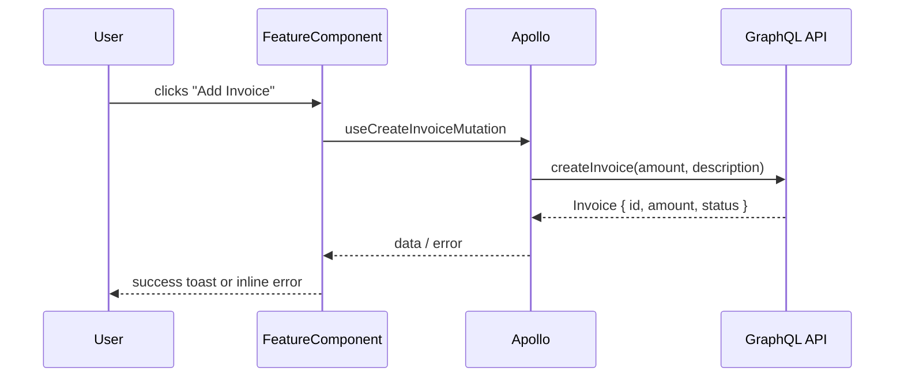

# Frontend Implementation Planner

## Step 1 — Parse arguments

Input: **$ARGUMENTS**

Two forms accepted:
- `<story-id-or-url>` — solo historia
- `<story-id-or-url> <backend-pr-url>` — historia + PR de boost-api para analizar

Separar los dos argumentos. El PR URL es cualquier argumento que empiece con `https://github.com/`.

Fetch the story:
- If URL: extract numeric ID from segment after `/story/`
- If number: use directly
- Call `stories-get-by-id` with `story_public_id: <ID>`
- Read: `name`, `description`, `story_type`, `labels`, `tasks`, `comments`

---

## Step 2 — Load context and explore the codebase

Read:
1. `${CLAUDE_PLUGIN_ROOT}/context/architecture.md`
2. `${CLAUDE_PLUGIN_ROOT}/context/graphql.md`
3. `${CLAUDE_PLUGIN_ROOT}/context/testing.md`
4. `${CLAUDE_PLUGIN_ROOT}/context/styling.md`

Then explore the actual codebase:
- `Glob` for existing components in the same domain
- `Grep` for existing GraphQL operations this feature might reuse or extend
- Check `src/graphql/types.ts` for existing generated types related to this feature
- Read 1–2 relevant existing components to anchor the plan in real code

---

## Step 3 — Detect backend dependencies

Check whether the story requires mutations, queries, or types that **do not yet exist** in the frontend:

```bash
grep -n "use.*Query\|use.*Mutation\|use.*Subscription" src/graphql/types.ts | grep -i "<feature-keyword>"
```

Set `BACKEND_REQUIRED` to `true` if any required operations are missing from `src/graphql/types.ts`.

---

## Step 4 — Fetch and analyze the backend PR

This step runs regardless of whether a PR URL was provided.

### If PR URL was provided in arguments:

Fetch the PR immediately:

```bash
gh pr view <PR-URL> --json number,title,state,mergedAt,baseRefName,headRefName,files
```

Then get the diff, filtering for GraphQL-relevant files:

```bash
gh pr diff <PR-URL>
```

From the diff, extract and hold in memory:
1. **New `.graphql` files** — exact mutation/query/subscription definitions with argument names and types
2. **Changes to schema dump** (any file matching `*schema*.graphql` or `schema.json`) — new types, enums, fields
3. **New mutation resolver methods** — confirm exact method names and return types
4. **PR state**: `open` / `merged` — affects the plan's execution readiness

### If NO PR URL was provided AND `BACKEND_REQUIRED = true`:

```
⛔ This story requires backend changes — a boost-api PR URL is required.

Planning against guessed types produces a plan that breaks at execution
when codegen generates different names than expected.

Provide the backend PR URL:
  /boost-client-dev:plan [story] https://github.com/boost-legal/boost-api/pull/N

If the backend PR doesn't exist yet:
  1. Plan the backend first: /boost-dev:plan [story] (in boost-api)
  2. Execute and open the PR: /boost-dev:execute plan-sc-[ID]-[slug].md
  3. Come back with the PR URL: /boost-client-dev:plan [story] <pr-url>

Or let boost-team coordinate both in parallel:
  /boost-team:plan-full [story]
```

**Stop. Do not generate a plan.**

### If `BACKEND_REQUIRED = false`:

Skip this step.

---

## Step 5 — Show your analysis (visible, not internal)

Output this block before writing anything:

```
### Analysis

- Domain:              [e.g., Invoices, Automations, Calendar]
- Type:                [Feature / Bug / Chore / Refactor]
- Layers affected:     [component, hook, graphql, redux, route, test]
- Pattern chosen:      [e.g., Apollo hook + functional component + LMLayers panel]
- Why:                 [1–2 sentences]
- Backend required:    [Yes (PR #123 — open) / Yes (PR #123 — merged) / Yes (no PR) / No]
- New GraphQL ops:     [exact names from PR diff, or "inferred — verify after codegen"]
- Existing components: [components being extended or reused]
- Diagram needed:      [yes if: 3+ components interact OR complex async data flow]
- Risks:               [anything that could go wrong or needs clarification]
```

Stop here if there are critical open questions. Otherwise proceed.

---

## Step 6 — Write the plan

Create `plan-sc-<ID>-<slug>.md` in the current directory.

> **Quality bar:** every section must be precise enough that no implementation decision requires guessing. When PR analysis is available, use the exact names and types from the diff — not approximations.

---

```markdown
# Plan: [Story Title]

**SC:** [SC-ID](URL)
**Branch:** `<git-username>/sc-<ID>/<short-slug>`
**Type:** Feature | Bug | Chore | Refactor
**Domain:** [domain]
**Complexity:** Low | Medium | High
**Backend Required:** No | Yes — PR #[N] ([open](URL) / [merged](URL)) | Yes — no PR yet

---

## Summary

[2–3 sentences. Synthesize the technical problem — don't copy the story description.]

---

## Technical Decision Record

- **Pattern:** [Component structure and why]
- **Data layer:** [Apollo hooks / Redux / local state — and why]
- **GraphQL surface:** [exact ops from PR diff, or "existing ops reused", or "to be confirmed after codegen"]
- **Backend dependency:** [PR link or "none" or "no PR yet — implement backend first"]
- **Trade-offs / risks:** [be honest]

---

## Flow Diagram

[Include ONLY if: 3+ components interact OR complex async/data flow. Omit entirely otherwise.]



---

## Backend GraphQL Surface

[Skip entirely if `Backend Required: No`]

[If PR was analyzed — use EXACT names from the diff:]

### Confirmed in PR #[N] ([state])

```graphql
# Exact definitions extracted from boost-api PR diff

mutation CreateInvoice($amount: Float!, $description: String): Invoice!

mutation UpdateInvoice($id: ID!, $amount: Float, $description: String): Invoice

mutation DeleteInvoice($id: ID!): Invoice

type Invoice {
  id: ID!
  amount: Float!
  description: String
  status: InvoiceStatus!
  createdAt: ISO8601DateTime!
}

enum InvoiceStatus {
  pending
  paid
  voided
}
```

[If PR is **open** (not merged yet):]

> ⚠️ PR #[N] is **open** — not yet merged. The executor will verify PR state before running.
> Types above are based on the PR diff and may change before merge.

[If PR is **merged**:]

> ✅ PR #[N] is **merged**. Run `npm run codegen` before executing this plan.

### After codegen, verify these hooks exist in `src/graphql/types.ts`:
- `useCreateInvoiceMutation`
- `useUpdateInvoiceMutation`
- `useDeleteInvoiceMutation`
- `InvoiceStatus` enum

[If NO PR was analyzed:]

> ⚠️ No PR provided — types below are **inferred** from story description.
> Verify against actual backend implementation before executing.

```graphql
# Expected — confirm exact names and types after backend is implemented
mutation CreateInvoice($amount: Float!, $description: String): Invoice!
# ...
```

---

## Files to Read Before Implementing

| File | Why |
|------|-----|
| `src/components/<domain>/similar_component/index.tsx` | Reference pattern for this domain |
| `src/graphql/types.ts` | Verify available types and hooks (after codegen if backend required) |
| `src/graphql/queries/<domain>/existing.graphql` | Existing operations to reuse or extend |

---

## Files to Create

| File | Responsibility |
|------|----------------|
| `src/components/<domain>/<component_name>/index.tsx` | Main component |
| `src/components/<domain>/<component_name>/__tests__/<component_name>.test.tsx` | Tests |
| `src/graphql/mutations/<domain>/<mutation_name>.graphql` | Client-side operation file |

---

## Files to Modify

| File | Exact change |
|------|-------------|
| `src/components/<domain>/parent/index.tsx` | Add route for new panel |
| `src/graphql/types.ts` | Regenerated via `npm run codegen` |

---

## Component Spec

### `<ComponentName>` (`src/components/<domain>/<component_name>/index.tsx`)

**Props:**
```ts
interface Props {
  firmId: string;
  onSuccess?: () => void;
}
```

**Behavior:**
- Fetches data via `use<X>Query({ variables: { firmId } })`
- Shows `<LMLoader />` while loading
- Shows empty state text "[exact copy]" when result is empty
- Shows inline error "[exact copy]" when query errors
- [describe each interaction precisely]

**Layout:**
```tsx
// Tachyons skeleton — exact classes required
<div className="flex flex-column flex-gap-3">
  <div className="flex justify-between items-center">
    <h2 className="fs16 b boost-secondary">[Title]</h2>
    <BoostButton title="[Label]" theme="success" icon="plus" action={openLayer} />
  </div>
  {/* list rows or empty state */}
</div>
```

---

## Failure Conditions (user-visible)

| Condition | What the user sees |
|-----------|-------------------|
| Query network error | "[Exact error text]" — inline, below the section header |
| Mutation error | Toast: `error.message` from Apollo |
| Form field invalid | "[Exact validation text]" — inline below the field |

---

## Test Scenarios

> Executor writes these FIRST (RED). Must fail before any implementation.
> Use exact text strings from Failure Conditions above.

### `src/components/<domain>/<name>/__tests__/<name>.test.tsx`

```tsx
// GraphQL mock shapes must match the Backend GraphQL Surface section exactly
const mockInvoice = {
  id: '1',
  amount: 100.0,
  description: 'Test invoice',
  status: 'pending',        // matches InvoiceStatus enum from PR
  createdAt: '2024-01-01T00:00:00Z',
};

describe('<ComponentName>', () => {
  it('shows loading state initially', () => { /* ... */ });
  it('renders list after loading', async () => { /* exact text assertions */ });
  it('shows empty state when no results', async () => { /* ... */ });
  it('shows error state on query failure', async () => { /* exact error text */ });
  it('[key interaction]', async () => { /* userEvent + assertion */ });
});
```

---

## Implementation Steps

### Step 1: [Name]

**Goal:** ...
**Files:** ...

```tsx
// Key skeleton — use exact hook names from Backend GraphQL Surface
const { data, loading, error } = useGetInvoicesQuery({ variables: { firmId } });
// exact mutation hook from codegen:
const [createInvoice, { loading: creating }] = useCreateInvoiceMutation({
  refetchQueries: ['GetInvoices'],
  onError: err => showErrorToast(err.message),
});
```

**Notes:** ...

---

[Repeat for each step]

---

## Checklist

- [ ] Tests written before implementing (RED before GREEN)
- [ ] All GraphQL hook names verified against `src/graphql/types.ts` (after codegen)
- [ ] Loading state: `LMLoader`
- [ ] Error state: exact text from Failure Conditions
- [ ] Empty state: explicit, not a blank render
- [ ] Only Tachyons + boost-* classes (no inline styles, no Tailwind)
- [ ] Only verified icon names
- [ ] Only existing component library (BoostButton, LMIcon, etc.)
- [ ] LMLayers wrapper has `flex flex-column flex-auto`
- [ ] `npm run codegen` run after adding .graphql files
- [ ] ESLint/Biome clean
- [ ] `tsc --noEmit` passes

---

## Open Questions

[Real blockers only. Omit if none.]
```

---

## Step 7 — Confirm

After writing the file, output:

```
### Plan saved: plan-sc-<ID>-<slug>.md

Branch: <branch-name>

Key decisions:
  1. [most important decision]
  2. [second decision]
  3. [third decision]

Backend status: [No dependency / PR #N open — must merge before executing /
                  PR #N merged — run codegen then execute / No PR yet]

[If PR open or no PR:]
Next step → backend:
  In boost-api: /boost-dev:plan <story-id>
  Then: /boost-dev:execute plan-sc-<ID>-<slug>.md

[If PR merged:]
Next step → ready to execute:
  npm run codegen
  /boost-client-dev:execute plan-sc-<ID>-<slug>.md

[If no backend dependency:]
Next step → ready to execute:
  /boost-client-dev:execute plan-sc-<ID>-<slug>.md

Sections that need human review before executing:
  - [anything uncertain]
```
