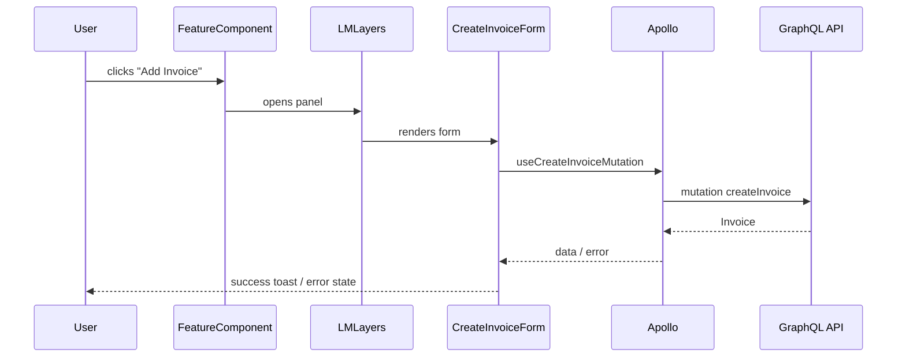

# Frontend Implementation Planner

## Step 1 — Fetch the story

Input: **$ARGUMENTS**

- If it's a URL, extract the numeric ID from the segment after `/story/`
- If it's a number, use it directly
- Call `stories-get-by-id` with `story_public_id: <ID>`
- Read: `name`, `description`, `story_type`, `labels`, `tasks`, `comments`

---

## Step 2 — Load context and explore the codebase

Read these files:

1. `${CLAUDE_PLUGIN_ROOT}/context/architecture.md`
2. `${CLAUDE_PLUGIN_ROOT}/context/graphql.md`
3. `${CLAUDE_PLUGIN_ROOT}/context/testing.md`
4. `${CLAUDE_PLUGIN_ROOT}/context/styling.md`

Then **explore the actual codebase**:

- `Glob` to find existing components in the same domain (`src/components/<domain>/`)
- `Grep` to find existing GraphQL operations that the feature might reuse or extend
- Check `src/graphql/types.ts` for existing generated types related to this feature
- Read 1–2 relevant existing components to anchor the plan in real code

---

## Step 3 — Detect backend dependencies

Check whether the story requires mutations, queries, or types that **do not yet exist** in the backend:

```bash
# Check if the operation exists in generated types
grep -n "mutation\|query\|CreateX\|UpdateX\|DeleteX" src/graphql/types.ts
```

Mark the plan with `BACKEND_REQUIRED: true` if any of these are missing. This section must be completed by the boost-api team before the frontend executor can run.

---

## Step 4 — Show your analysis (visible, not internal)

Output this block before writing anything:

```
### Analysis

- Domain:              [e.g., Invoices, Automations, Calendar]
- Type:                [Feature / Bug / Chore / Refactor]
- Layers affected:     [component, hook, graphql, redux, route, test]
- Pattern chosen:      [e.g., Apollo hook + functional component + LMLayers panel]
- Why:                 [1–2 sentences]
- New GraphQL ops:     [list or "none"]
- Backend required:    [yes/no — list missing mutations/queries if yes]
- Existing components: [components being extended or reused]
- Diagram needed:      [yes if: 3+ components interact OR complex async data flow]
- Risks:               [anything that could go wrong or needs clarification]
```

Stop here if there are critical open questions. Otherwise proceed.

---

## Step 5 — Write the plan

Create `plan-sc-<ID>-<slug>.md` in the current directory.

> **Quality bar:** this plan will be consumed by an automated executor. Every section must be precise enough that no implementation decision is left to guessing.

---

```markdown
# Plan: [Story Title]

**SC:** [SC-ID](URL)
**Branch:** `<git-username>/sc-<ID>/<short-slug>`
**Type:** Feature | Bug | Chore | Refactor
**Domain:** [domain]
**Complexity:** Low | Medium | High
**Backend Required:** Yes | No

---

## Summary

[2–3 sentences. Synthesize the technical problem — don't copy the story description.]

---

## Technical Decision Record

- **Pattern:** [Component structure and why]
- **Data layer:** [Apollo hooks / Redux / local state — and why]
- **GraphQL surface:** [existing ops / new ops needed / none]
- **Backend dependency:** [what boost-api must implement first, or "none"]
- **Trade-offs / risks:** [be honest]

---

## Flow Diagram

[Include ONLY if: 3+ components interact OR complex async/data flow. Omit entirely otherwise.]



---

## Backend Changes Required

[Skip entirely if `Backend Required: No`]

> ⚠️ These changes must be implemented in **boost-api** before running the frontend executor.
> Use `/boost-dev:plan <story-id>` in the boost-api project to generate the backend plan.

### New mutations needed

```graphql
mutation CreateInvoice($amount: Float!, $description: String): Invoice!
mutation UpdateInvoice($id: ID!, $amount: Float, $description: String): Invoice!
```

### New types / fields needed

```graphql
type Invoice {
  id: ID!
  amount: Float!
  description: String
  status: InvoiceStatus!
  createdAt: ISO8601DateTime!
}

enum InvoiceStatus {
  pending
  paid
  voided
}
```

### Verification

After backend is merged, run in boost-client:
```bash
npm run codegen
```

Confirm the types appear in `src/graphql/types.ts` before proceeding to execute.

---

## Files to Read Before Implementing

The executor must read these files in full before writing any code.

| File | Why |
|------|-----|
| `src/components/<domain>/similar_component/index.tsx` | Reference pattern for this domain |
| `src/graphql/types.ts` | Verify available types and hooks |
| `src/graphql/queries/<domain>/existing.graphql` | Existing operations to reuse/extend |

---

## Files to Create

| File | Responsibility |
|------|----------------|
| `src/components/<domain>/<component_name>/index.tsx` | Main component |
| `src/components/<domain>/<component_name>/__tests__/<component_name>.test.tsx` | Tests |
| `src/graphql/mutations/<domain>/<mutation_name>.graphql` | Mutation definition (if new) |

---

## Files to Modify

| File | Exact change |
|------|-------------|
| `src/components/<domain>/parent/index.tsx` | Add route for new panel |
| `src/graphql/types.ts` | Regenerate via `npm run codegen` after new .graphql files |

---

## Component Spec

> Precise enough that no UI decision is left to guessing.

### `<ComponentName>` (`src/components/<domain>/<component_name>/index.tsx`)

**Props:**
```ts
interface Props {
  firmId: string;
  onSuccess?: () => void;
}
```

**Behavior:**
- Fetches invoices via `useGetInvoicesQuery({ variables: { firmId } })`
- Shows `<LMLoader />` while loading
- Shows empty state message when `invoices.length === 0`
- Shows error state when query errors
- Each row has an Edit button (`icon="edit"`) that opens the edit layer
- Each row has a Delete button (`icon="trash"`) that opens `LMDeleteDialog`

**Layout:**
```
<div className="flex flex-column flex-gap-3">
  <div className="flex justify-between items-center">
    <h2 className="fs16 b boost-secondary">Invoices</h2>
    <BoostButton title="Add Invoice" theme="success" icon="plus" action={openAddLayer} />
  </div>
  {/* list or empty state */}
</div>
```

---

## Failure Conditions (user-visible errors)

| Condition | What the user sees |
|-----------|-------------------|
| Query fails | Error message inline: "Failed to load invoices. Please refresh." |
| Mutation fails | Toast error: exact `error.message` from Apollo |
| Form validation | Inline field error below the input |

---

## Test Scenarios

> The executor writes these tests FIRST (RED), then implements until GREEN.
> Every assertion must use exact text/roles — no `.toBeInTheDocument()` without specificity.

### `src/components/<domain>/<name>/__tests__/<name>.test.tsx`

```tsx
describe('<ComponentName>', () => {
  it('renders loading state initially', () => {
    // arrange: MockedProvider with delayed response
    // assert: screen.getByTestId('lm-loader') is in the document
  });

  it('renders list of invoices after loading', async () => {
    // arrange: MockedProvider with 2 invoices
    // assert: screen.findAllByRole('row') resolves to 2 items
    // assert: screen.getByText('Test invoice') is visible
    // assert: screen.getByText('$100.00') is visible
  });

  it('shows empty state when no invoices', async () => {
    // arrange: MockedProvider with empty array
    // assert: screen.findByText(/no invoices/i) resolves
  });

  it('shows error state on query failure', async () => {
    // arrange: MockedProvider with error: new Error('Network error')
    // assert: screen.findByText(/failed to load/i) resolves
  });

  it('opens add panel when Add Invoice is clicked', async () => {
    // arrange: rendered component
    // act: userEvent.click(screen.getByRole('button', { name: /add invoice/i }))
    // assert: screen.findByRole('heading', { name: /add invoice/i }) resolves
  });
});
```

---

## Implementation Steps

Ordered. Each step is atomic. Executor runs tests after each step.

### Step 1: [Name]

**Goal:** ...
**Files:** ...
**Key decisions:**
- Which existing component to extend
- Which Apollo hook to use (from `graphql/types.ts`)
- Which Tachyons classes for layout

```tsx
// Skeleton with key patterns
const MyComponent: React.FC<Props> = ({ firmId }) => {
  const { data, loading, error } = useGetInvoicesQuery({ variables: { firmId } });

  if (loading) return <LMLoader />;
  if (error) return <div className="fs14 boost-danger pa3">{error.message}</div>;
  if (!data?.invoices?.length) return <EmptyState />;

  return (/* ... */);
};
```

**Notes:** Any edge cases or things the executor must not skip.

---

[Repeat for each step]

---

## Checklist

[Only items relevant to this plan]

- [ ] Tests written before implementing (RED before GREEN)
- [ ] Loading state renders `LMLoader`
- [ ] Error state renders user-visible message
- [ ] Empty state handled explicitly
- [ ] Only Tachyons + boost-* classes used (no inline styles, no Tailwind)
- [ ] Only existing icon names used
- [ ] Only existing component library components used (no custom Button/Icon)
- [ ] LMLayers wrapper has `flex flex-column flex-auto`
- [ ] Apollo types imported from `graphql/types.ts` (no `any`)
- [ ] `npm run codegen` run if new .graphql files added
- [ ] ESLint/Biome passes on all modified files
- [ ] Backend changes documented and tracked (if applicable)

---

## Open Questions

[Real blockers only. Omit if none.]
```

---

## Step 6 — If backend changes are required: coordinate

When `Backend Required: Yes`, after saving the plan file, output:

```
⚠️  This story requires backend changes in boost-api before the frontend can be executed.

To generate the backend plan, open boost-api and run:
  /boost-dev:plan <story-id>

The backend plan should implement:
  [list the mutations/types from the Backend Changes Required section]

Once boost-api changes are merged and codegen is run, execute the frontend plan:
  /boost-client-dev:execute plan-sc-<ID>-<slug>.md
```

---

## Step 7 — Confirm

After writing the file, output:
- File path saved
- Branch name (ready to copy)
- The 3 most important decisions made
- Whether backend changes are required (and what)
- Sections that need human refinement before handing to the executor
