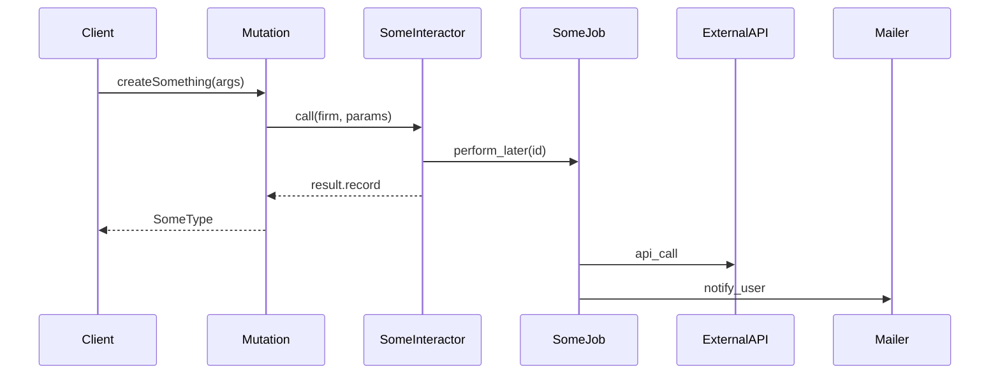

# Implementation Planner

## Step 1 — Fetch the story

Input: **$ARGUMENTS**

- If it's a URL, extract the numeric ID from the segment after `/story/`
- If it's a number, use it directly
- Call `stories-get-by-id` with `story_public_id: <ID>`
- Read: `name`, `description`, `story_type`, `labels`, `tasks`, `comments`

---

## Step 2 — Load context and explore the codebase

Read these files:

1. `${CLAUDE_PLUGIN_ROOT}/context/architecture.md`
2. `${CLAUDE_PLUGIN_ROOT}/context/graphql.md`
3. `${CLAUDE_PLUGIN_ROOT}/context/testing.md`
4. `${CLAUDE_PLUGIN_ROOT}/context/database.md`

Then **explore the actual codebase**:

- `Glob` to find existing interactors/services in the same domain
- `Grep` to find similar model names, concern usage, or existing mutations
- Read 1–2 relevant existing files to anchor the plan in real code

---

## Step 3 — Show your analysis (visible, not internal)

Output this block before writing anything:

```
### Analysis

- Domain:           [e.g., Automations, Billing, Leads]
- Type:             [Feature / Bug / Chore / Refactor]
- Layers affected:  [model, interactor, mutation, job, migration, policy, ...]
- Pattern chosen:   [e.g., interactor + GraphQL mutation module]
- Why:              [1–2 sentences]
- Async?:           [yes/no + reason]
- Migration?:       [yes/no + summary]
- Diagram needed?:  [yes if: async job OR 3+ components in chain OR complex state/decision logic]
- Risks:            [anything that could go wrong or needs clarification]
```

Stop here if there are critical open questions. Otherwise proceed.

---

## Step 4 — Write the plan

Create `plan-sc-<ID>-<slug>.md` in the current directory.

> **Quality bar:** this plan will be consumed by an automated executor. Every section must be precise enough that no implementation decision is left to guessing. Vague descriptions will produce incorrect code.

---

```markdown
# Plan: [Story Title]

**SC:** [SC-ID](URL)
**Branch:** `<git-username>/sc-<ID>/<short-slug>`
**Type:** Feature | Bug | Chore | Refactor
**Domain:** [domain]
**Complexity:** Low | Medium | High

---

## Summary

[2–3 sentences. Synthesize the technical problem — don't copy the story description.]

---

## Technical Decision Record

- **Pattern:** [What and why]
- **GraphQL surface:** [mutation / query / new type fields / none]
- **Async:** [yes/no — reason]
- **Trade-offs / risks:** [be honest]

---

## Flow Diagram

[Include ONLY if: async job OR 3+ components in chain OR complex decision/state logic. Omit entirely otherwise.]



---

## Files to Read Before Implementing

The executor must read these files in full before writing any code.

| File | Why |
|------|-----|
| `app/interactors/<domain>/similar.rb` | Reference pattern for this domain |
| `app/models/some_model.rb` | Existing associations and validations |
| `spec/factories/some_model.rb` | Existing factory structure to extend |
| `spec/support/gql_helpers.rb` | Available GraphQL test helpers |

---

## Files to Create

| File | Responsibility |
|------|----------------|
| `app/interactors/<domain>/<name>.rb` | ... |
| `app/graphql/types/mutations/<domain>_mutation_type.rb` | ... |
| `spec/interactors/<domain>/<name>_spec.rb` | ... |
| `spec/mutations/<domain>/<name>_spec.rb` | ... |

---

## Files to Modify

| File | Exact change |
|------|-------------|
| `app/graphql/types/mutations/mutation_type.rb` | Add `include Types::Mutations::NewMutationType` |
| `app/models/some_model.rb` | Add `has_many :new_records` |

---

## Database Migration

[Skip entirely if no migration needed]

```ruby
# File: db/migrate/TIMESTAMP_description.rb
# Action: create_table / add_column / add_index
# Reversibility: yes

create_table :table_name do |t|
  t.references :firm, null: false, foreign_key: true, index: true
  t.string :field_name, null: false
  t.timestamps
end
```

Post-migration commands:
```bash
bundle exec rails db:migrate RAILS_ENV=test
bundle exec annotaterb annotate_models
```

---

## Business Rules

Every rule the executor must enforce. Be exhaustive — if it's not here, it won't be implemented.

- Rule 1: [e.g., Invoice can only be created if `firm.billing_enabled?`]
- Rule 2: [e.g., Amount must be > 0]
- Rule 3: [e.g., If `firm.feature?(:notifications)`, send email after save]

---

## Failure Conditions

Every `context.fail!` the interactor must have, with the exact error message string.

| Condition | Exact error message |
|-----------|-------------------|
| [e.g., billing not enabled] | `"Billing not enabled for this firm"` |
| [e.g., amount <= 0] | `"Amount must be greater than 0"` |
| [e.g., record save fails] | `"Save error: #{record.formatted_errors}"` |

---

## Side Effects (on success)

What happens after the happy path. If empty, write "None."

- **Jobs:** [e.g., `InvoiceJob.perform_later(invoice.id)` if `firm.feature?(:async_invoicing)`]
- **Emails:** [e.g., `InvoiceMailer.created(invoice).deliver_later`]
- **Activity:** [e.g., `invoice.create_activity(:created, owner: current_user)`]
- **Other:** [e.g., update parent record, invalidate cache]

---

## Spec Skeleton

> The executor writes these specs first, verifies they FAIL, then implements until they PASS.
> Every assertion must use exact values — no `be_present` where a value is knowable.

### `spec/interactors/<domain>/<name>_spec.rb`

```ruby
RSpec.describe Domain::DoSomething do
  let_it_be(:firm) { SpecContext.firm }
  let_it_be(:user) { create(:firm_user, firm:) }
  let(:params)     { { amount: 100.0, description: 'Test invoice' } }

  subject(:result) { described_class.call(firm:, user:, params:) }

  it 'creates the record with correct attributes' do
    expect(result).to be_success
    expect(result.invoice).to be_persisted
    expect(result.invoice.amount).to eq(100.0)
    expect(result.invoice.firm).to eq(firm)
  end

  it 'enqueues InvoiceJob after creation' do
    expect { result }.to have_enqueued_job(InvoiceJob)
  end

  context 'when billing is not enabled' do
    before { firm.update!(billing_enabled: false) }

    it 'fails with exact error' do
      expect(result).to be_failure
      expect(result.error).to eq('Billing not enabled for this firm')
    end
  end

  context 'when amount is zero' do
    let(:params) { { amount: 0 } }

    it 'fails with exact error' do
      expect(result).to be_failure
      expect(result.error).to eq('Amount must be greater than 0')
    end
  end
end
```

### `spec/mutations/<domain>/<name>_spec.rb`

```ruby
RSpec.describe 'Mutation: createInvoice' do
  let(:variables) { { amount: 100.0 } }

  subject(:response) { create_invoice(variables) }

  it 'returns the created invoice' do
    expect(response.dig('data', 'createInvoice', 'id')).to be_present
    expect(response.dig('data', 'createInvoice', 'amount')).to eq(100.0)
  end

  context 'when billing is not enabled' do
    before { SpecContext.firm.update!(billing_enabled: false) }

    it 'returns specific error' do
      expect(response['errors'].first['message']).to eq('Billing not enabled for this firm')
    end
  end
end
```

### Factory (if new model)

```ruby
# spec/factories/<model>.rb
factory :<model> do
  firm        { SpecContext.firm }
  amount      { 100.0 }
  description { 'Test invoice' }
  status      { :pending }

  trait :paid do
    status { :paid }
  end
end
```

---

## Implementation Steps

Ordered. Each step is atomic. The executor runs specs after each step.

### Step 1: [Name]

**Goal:** ...
**Files:** ...

```ruby
# Full method signatures + business logic skeleton
# Include: guard clauses, context.fail! messages, side effects
def call
  validate_firm!
  create_invoice
  enqueue_job if firm.feature?(:async_invoicing)
end

private

def validate_firm!
  context.fail!(error: 'Billing not enabled for this firm') unless firm.billing_enabled?
end
```

**Notes:** edge cases, rescue considerations, things the executor must not skip.

---

[Repeat for each step]

---

## Checklist

[Only items relevant to this plan]

- [ ] Specs written before implementing (RED before GREEN)
- [ ] Business rules all implemented and covered by specs
- [ ] Failure conditions match exact messages in Spec Skeleton
- [ ] Side effects tested with `have_enqueued_job` / `have_enqueued_mail`
- [ ] `firm_id` scoped on all new queries
- [ ] `acts_as_paranoid` if user-facing entity
- [ ] Pundit policy created/updated
- [ ] Mutation module included in `mutation_type.rb`
- [ ] `bundle exec rake graphql:dump` committed (if GraphQL changed)
- [ ] Migration reversible, `annotaterb` committed
- [ ] `safety_assured` avoided or justified

---

## Open Questions

[Real blockers only. Omit if none.]
```

---

## Step 5 — Confirm

After writing the file, output:
- File path saved
- Branch name (ready to copy)
- The 3 most important decisions made
- Whether a diagram was generated and why
- Sections that need human refinement before handing to the executor
