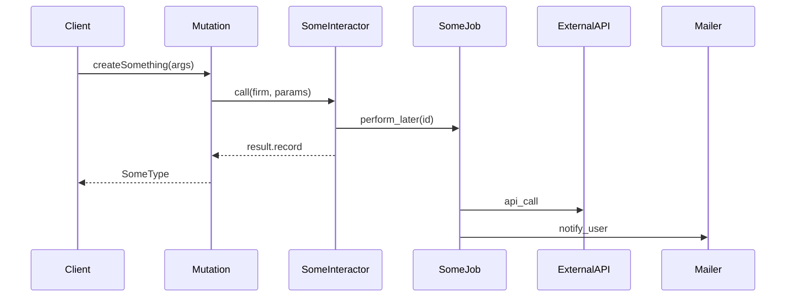
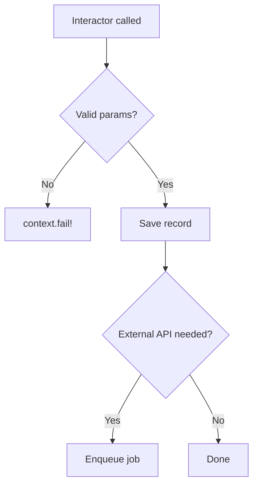

# Implementation Planner

## Step 1 — Fetch the story

Input: **$ARGUMENTS**

- If it's a URL, extract the numeric ID from the segment after `/story/`
- If it's a number, use it directly
- Call `stories-get-by-id` with `story_public_id: <ID>`
- Read: `name`, `description`, `story_type`, `labels`, `tasks`, `comments`

---

## Step 2 — Load context and explore the codebase

Read these files (they document current conventions of this project):

1. `${CLAUDE_PLUGIN_ROOT}/context/architecture.md`
2. `${CLAUDE_PLUGIN_ROOT}/context/graphql.md`
3. `${CLAUDE_PLUGIN_ROOT}/context/testing.md`
4. `${CLAUDE_PLUGIN_ROOT}/context/database.md`

Then **explore the actual codebase** before deciding anything:

- `Glob` to find existing interactors/services in the same domain
- `Grep` to find similar model names, concern usage, or existing mutations
- Read 1–2 relevant existing files to see how the pattern is applied today

---

## Step 3 — Show your analysis (visible, not internal)

Output this block before writing anything:

```
### Analysis

- Domain:           [e.g., Automations, Billing, Leads]
- Type:             [Feature / Bug / Chore / Refactor]
- Layers affected:  [model, interactor, mutation, job, migration, policy, ...]
- Pattern chosen:   [e.g., interactor + GraphQL mutation module]
- Why:              [1–2 sentences]
- Async?:           [yes/no + reason]
- Migration?:       [yes/no + summary]
- Diagram needed?:  [yes if: async job OR 3+ components in chain OR complex state/decision logic]
- Risks:            [anything that could go wrong or needs clarification]
```

Stop here if there are critical open questions. Otherwise proceed.

---

## Step 4 — Write the plan

Create `plan-sc-<ID>-<slug>.md` in the current directory using this exact structure:

---

```markdown
# Plan: [Story Title]

**SC:** [SC-ID](URL)
**Branch:** `<git-username>/sc-<ID>/<short-slug>`
**Type:** Feature | Bug | Chore | Refactor
**Domain:** [domain]
**Complexity:** Low | Medium | High

---

## Summary

[2–3 sentences. Synthesize — don't copy the story description.]

---

## Technical Decision Record

- **Pattern:** [What and why]
- **GraphQL surface:** [mutation / query / new fields / none]
- **Async:** [yes/no — reason]
- **Trade-offs / risks:** [be honest]

---

## Flow Diagram

[Include ONLY if: async job involved, OR 3+ components in chain, OR complex decision/state logic.
Omit this section entirely for simple CRUD mutations.]

Use `sequenceDiagram` for async flows:



Use `flowchart TD` for complex conditional or state logic:



---

## Files to Create

| File | Responsibility |
|------|----------------|
| `app/interactors/...` | ... |
| `app/graphql/types/mutations/...` | ... |
| `spec/interactors/...` | ... |

---

## Files to Modify

| File | Change |
|------|--------|
| `app/graphql/types/mutations/mutation_type.rb` | include new module |

---

## Database Migration

[Skip section entirely if no migration needed]

- Table / columns / types / null constraints / indexes
- Reversibility: yes / no (if no, explain why)
- Large table risk: yes/no — if yes, describe safe strategy (nullable first, backfill, constrain)
- After migration: `bundle exec annotaterb annotate_models` — commit the annotation changes

---

## Spec Skeleton

> Write these specs **before** implementing. Red → Green → Refactor.
> The implementation exists to make these pass — not the other way around.

### `spec/interactors/<domain>/<interactor_name>_spec.rb`

```ruby
RSpec.describe Domain::DoSomething do
  let_it_be(:firm) { SpecContext.firm }
  let_it_be(:user) { create(:firm_user, firm:) }
  let(:params)     { { field: value } }

  subject(:result) { described_class.call(firm:, params:, user:) }

  it 'does the thing' do
    expect(result).to be_success
    expect(result.record).to be_persisted
  end

  context 'when [invalid condition]' do
    let(:params) { { field: nil } }

    it 'fails with an error' do
      expect(result).to be_failure
      expect(result.error).to include('...')
    end
  end
end
```

### `spec/mutations/<domain>/<mutation_name>_spec.rb`

```ruby
RSpec.describe 'Mutation: doSomething' do
  let(:variables) { { field: value } }

  subject(:response) { do_something(variables) }

  it 'returns the record' do
    expect(response.dig('data', 'doSomething', 'id')).to be_present
  end

  context 'when feature is disabled' do
    it 'returns an error' do
      expect(response['errors'].first['message']).to include('not enabled')
    end
  end
end
```

[Add factory skeleton for every new model introduced]

```ruby
# spec/factories/<model>.rb
factory :<model> do
  firm  { SpecContext.firm }
  field { value }
end
```

---

## Implementation Steps

Ordered. Each step = one atomic commit. Specs from the skeleton above should pass after each step.

### Step 1: [Name]

**Goal:** ...
**Files:** ...

```ruby
# Skeleton — method signatures and critical logic only
```

**Notes:** edge cases, gotchas, rescue considerations.

---

[Repeat for each step]

---

## Checklist

[Include ONLY items relevant to what this plan actually touches]

- [ ] Specs written before implementing (TDD: spec → implementation)
- [ ] `firm_id` scoped on all new queries
- [ ] `acts_as_paranoid` on user-facing entities
- [ ] Pundit policy created/updated
- [ ] Mutation module included in `mutation_type.rb`
- [ ] `bundle exec rake graphql:dump` run and committed (if GraphQL changed)
- [ ] Sidekiq job for any async/external work
- [ ] Migration is reversible (CI runs UP → DOWN → UP)
- [ ] `bundle exec annotaterb annotate_models` run and committed (if migration added)
- [ ] `let_it_be` for shared test data, `let!` for eager per-group setup
- [ ] `safety_assured` avoided — if used, justified in PR description

---

## Open Questions

[List only real blockers. Omit section if none.]
```

---

## Step 5 — Confirm

After writing the file, output:
- File path saved
- Branch name (ready to copy)
- The 3 most important architectural decisions
- Whether a diagram was generated and why (or why not)
- Any open questions requiring clarification before development starts
